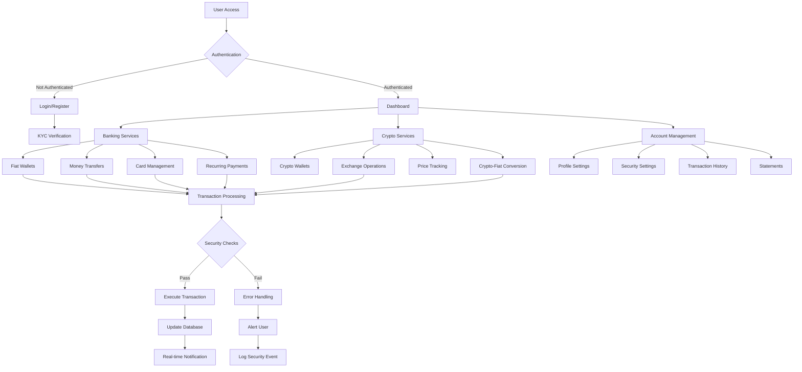
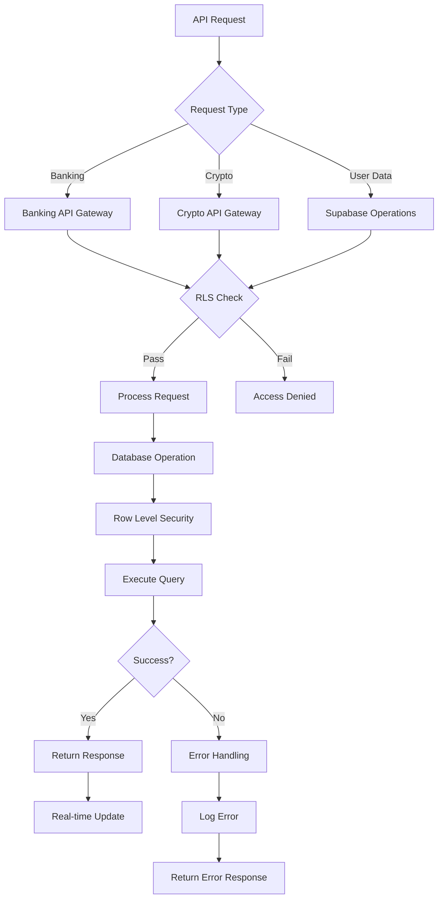
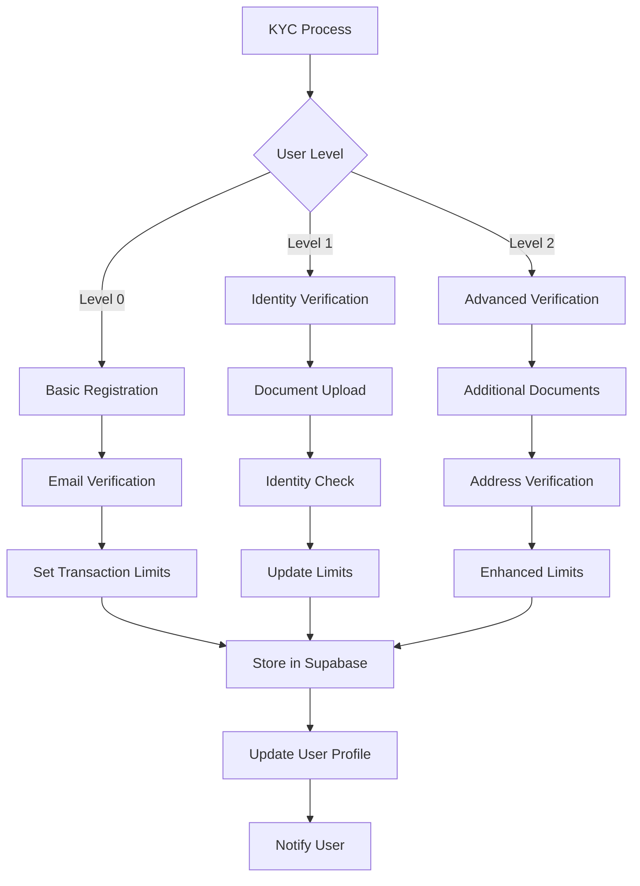
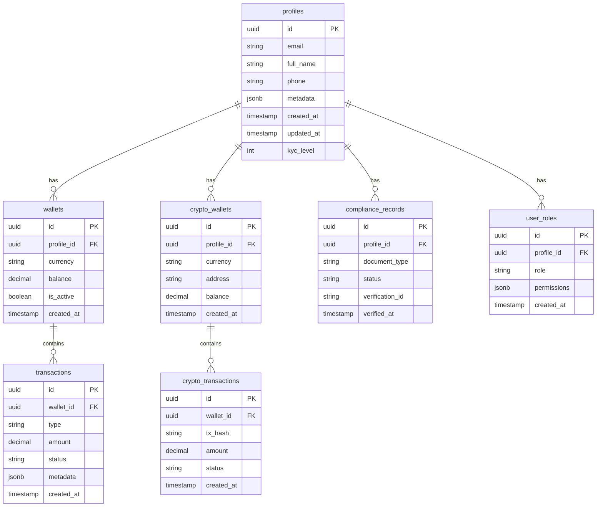
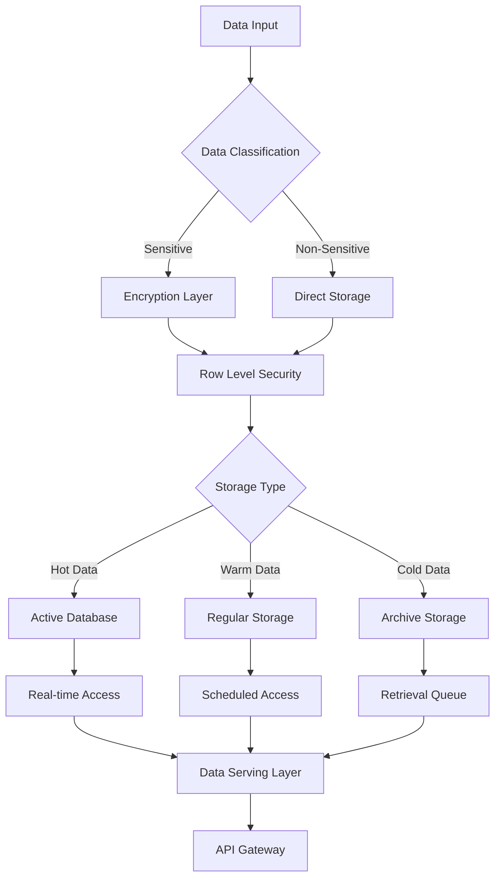
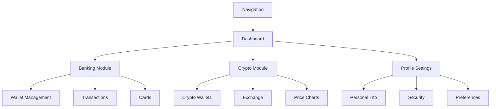

# Product Requirements Document (PRD)

# 1. INTRODUCTION

## 1.1 Purpose

This Product Requirements Document (PRD) outlines the comprehensive specifications, requirements, and technical architecture for the Unbanked platform. The document serves as a reference for:

- Development teams implementing the platform
- Project managers overseeing development
- Stakeholders evaluating project scope and progress
- QA teams designing test strategies
- Security auditors reviewing compliance measures

## 1.2 Scope

Unbanked is a modern financial platform that integrates traditional banking services with cryptocurrency capabilities. The platform aims to:

- Provide accessible financial services to users globally
- Bridge the gap between traditional banking and cryptocurrency
- Enable secure and compliant financial transactions
- Support both fiat and cryptocurrency management

### Core Functionalities

1. Banking Services
   - Digital banking dashboard
   - Multi-currency fiat wallets
   - Global money transfers
   - Virtual and physical card management
   - Recurring payment systems
   - Account statements and reporting

2. Cryptocurrency Features
   - Cryptocurrency wallets
   - Exchange integration
   - Real-time crypto price tracking
   - Seamless crypto-fiat conversions

3. Security and Compliance
   - KYC/AML verification processes
   - Multi-factor authentication
   - Transaction monitoring and limits
   - Comprehensive audit logging
   - Role-based access control

4. Technical Infrastructure
   - React-based frontend with TypeScript
   - Supabase backend infrastructure
   - PostgreSQL database with row-level security
   - Real-time data synchronization
   - Secure file storage for KYC documents

# 2. PRODUCT DESCRIPTION

## 2.1 Product Perspective

Unbanked operates as a comprehensive financial platform that integrates with existing banking and cryptocurrency infrastructure. The system interfaces with:

- Traditional banking networks for fiat transactions
- Cryptocurrency exchanges and blockchain networks
- KYC/AML verification services
- Payment processing networks
- Financial regulatory compliance systems

The platform functions as a standalone system while maintaining crucial integrations with external financial services through secure APIs.

## 2.2 Product Functions

The core functions of Unbanked include:

1. Account Management
   - User registration and profile management
   - Multi-factor authentication
   - KYC verification processes
   - Role-based access control

2. Banking Operations
   - Multi-currency fiat wallet management
   - Domestic and international transfers
   - Virtual and physical card issuance
   - Recurring payment scheduling
   - Transaction history and statements

3. Cryptocurrency Operations
   - Multi-cryptocurrency wallet management
   - Real-time exchange rate monitoring
   - Crypto-fiat conversions
   - Integration with major exchanges

4. Security and Compliance
   - Transaction monitoring and flagging
   - Audit trail maintenance
   - Regulatory reporting
   - Security policy enforcement

## 2.3 User Characteristics

1. Regular Users
   - Age: 18+
   - Basic financial literacy
   - Various levels of crypto experience
   - Mobile-first preference
   - Global distribution

2. Business Users
   - Small to medium enterprises
   - Need for multi-currency operations
   - Regular international transactions
   - Multiple user access requirements

3. Administrative Users
   - Financial compliance officers
   - Customer support representatives
   - System administrators
   - Security analysts

## 2.4 Constraints

1. Technical Constraints
   - Supabase platform limitations
   - API rate limits from external services
   - Real-time data synchronization requirements
   - Mobile device compatibility requirements

2. Regulatory Constraints
   - Banking regulations in operating jurisdictions
   - Cryptocurrency trading restrictions
   - Data protection requirements (GDPR, CCPA)
   - KYC/AML compliance requirements

3. Security Constraints
   - Encryption requirements for sensitive data
   - Authentication protocol standards
   - Transaction limit thresholds
   - Audit trail maintenance requirements

## 2.5 Assumptions and Dependencies

### Assumptions
1. Users have access to stable internet connectivity
2. Cryptocurrency markets remain operational and regulated
3. Banking partners maintain API availability
4. Regulatory environment remains favorable for crypto-banking services

### Dependencies
1. External Services
   - Banking API providers
   - Cryptocurrency exchange APIs
   - KYC verification services
   - Payment processing networks

2. Infrastructure
   - Supabase platform availability
   - Cloud storage services
   - Database performance
   - Network security systems

3. Third-Party Components
   - React and TypeScript frameworks
   - Tailwind CSS and shadcn/ui
   - React Query
   - Cryptocurrency price feeds

# 3. PROCESS FLOWCHART

# 4. FUNCTIONAL REQUIREMENTS

## 4.1 Authentication & Authorization

### ID: F-AUTH
### Description
User authentication and authorization system managing access control and security.
### Priority: HIGH
### Requirements

| ID | Requirement | Priority |
|---|---|---|
| F-AUTH-1 | Email and password-based user registration with email verification | HIGH |
| F-AUTH-2 | Multi-factor authentication using authenticator apps or SMS | HIGH |
| F-AUTH-3 | Role-based access control (user, admin, support) | HIGH |
| F-AUTH-4 | Password reset functionality with secure token generation | HIGH |
| F-AUTH-5 | Session management with automatic timeout | MEDIUM |
| F-AUTH-6 | Social authentication integration (Google, Apple) | LOW |

## 4.2 Banking Services

### ID: F-BANK
### Description
Core banking functionalities including wallet management and transfers.
### Priority: HIGH
### Requirements

| ID | Requirement | Priority |
|---|---|---|
| F-BANK-1 | Multi-currency fiat wallet creation and management | HIGH |
| F-BANK-2 | Domestic and international money transfers | HIGH |
| F-BANK-3 | Virtual and physical card issuance and management | HIGH |
| F-BANK-4 | Recurring payment setup and management | MEDIUM |
| F-BANK-5 | Transaction history with detailed metadata | HIGH |
| F-BANK-6 | Account statements generation in multiple formats | MEDIUM |

## 4.3 Cryptocurrency Operations

### ID: F-CRYPTO
### Description
Cryptocurrency management and exchange functionalities.
### Priority: HIGH
### Requirements

| ID | Requirement | Priority |
|---|---|---|
| F-CRYPTO-1 | Multi-cryptocurrency wallet creation and management | HIGH |
| F-CRYPTO-2 | Real-time cryptocurrency price tracking | HIGH |
| F-CRYPTO-3 | Crypto-to-fiat conversion | HIGH |
| F-CRYPTO-4 | Integration with major cryptocurrency exchanges | HIGH |
| F-CRYPTO-5 | Cryptocurrency transaction history | HIGH |
| F-CRYPTO-6 | Custom alerts for price movements | LOW |

## 4.4 KYC/Compliance

### ID: F-COMP
### Description
Regulatory compliance and verification systems.
### Priority: HIGH
### Requirements

| ID | Requirement | Priority |
|---|---|---|
| F-COMP-1 | Tiered KYC verification process | HIGH |
| F-COMP-2 | Document upload and verification system | HIGH |
| F-COMP-3 | AML transaction monitoring and flagging | HIGH |
| F-COMP-4 | Risk assessment scoring | MEDIUM |
| F-COMP-5 | Regulatory reporting automation | MEDIUM |
| F-COMP-6 | Compliance audit trail maintenance | HIGH |

## 4.5 Security

### ID: F-SEC
### Description
Platform security features and monitoring systems.
### Priority: HIGH
### Requirements

| ID | Requirement | Priority |
|---|---|---|
| F-SEC-1 | Row-level security implementation in Supabase | HIGH |
| F-SEC-2 | Real-time fraud detection system | HIGH |
| F-SEC-3 | Transaction signing and verification | HIGH |
| F-SEC-4 | IP-based access control | MEDIUM |
| F-SEC-5 | Security event logging and alerting | HIGH |
| F-SEC-6 | Encryption for data at rest and in transit | HIGH |

## 4.6 User Management

### ID: F-USER
### Description
User profile and preference management.
### Priority: MEDIUM
### Requirements

| ID | Requirement | Priority |
|---|---|---|
| F-USER-1 | Profile creation and management | HIGH |
| F-USER-2 | Notification preferences configuration | MEDIUM |
| F-USER-3 | Language and locale settings | MEDIUM |
| F-USER-4 | Activity log access | MEDIUM |
| F-USER-5 | Device management | HIGH |
| F-USER-6 | Account closure process | LOW |

# 5. NON-FUNCTIONAL REQUIREMENTS

## 5.1 Performance Requirements

| Requirement | Description | Target Metric |
|------------|-------------|---------------|
| Response Time | Maximum time for API responses | < 500ms for 95% of requests |
| Database Queries | Query execution time | < 100ms for 90% of queries |
| Page Load Time | Initial page load performance | < 2s for main dashboard |
| Real-time Updates | Latency for live data updates | < 100ms for crypto prices |
| API Rate Limits | Maximum requests per user | 1000 requests/minute |
| Concurrent Users | Simultaneous active users supported | 100,000 users |
| Transaction Processing | Time to complete financial transactions | < 3s for crypto, < 5s for fiat |

## 5.2 Safety Requirements

| Requirement | Description | Implementation |
|------------|-------------|----------------|
| Data Backup | Regular backup of all user data | Every 6 hours with 30-day retention |
| Disaster Recovery | Recovery time objective (RTO) | < 4 hours |
| System Redundancy | Failover capabilities | Multi-region deployment |
| Transaction Rollback | Automatic reversal of failed transactions | Within 1 minute of failure |
| Error Handling | Graceful degradation of services | Fallback to essential services |
| Data Loss Prevention | Recovery point objective (RPO) | < 15 minutes |
| System Monitoring | Health check frequency | Every 30 seconds |

## 5.3 Security Requirements

| Requirement | Description | Standard/Implementation |
|------------|-------------|------------------------|
| Data Encryption | Encryption for data at rest and transit | AES-256 for storage, TLS 1.3 for transit |
| Authentication | Multi-factor authentication | TOTP or SMS-based 2FA |
| Session Management | Session handling and timeout | 15-minute idle timeout |
| API Security | API access control | OAuth 2.0 with JWT |
| Database Security | Row-level security in Supabase | Custom RLS policies per table |
| Audit Logging | Security event tracking | All security events logged with timestamps |
| Password Policy | Password complexity requirements | Min 12 chars, special chars, numbers |

## 5.4 Quality Requirements

### 5.4.1 Availability
- System uptime: 99.95% excluding planned maintenance
- Planned maintenance windows: Maximum 4 hours monthly
- Service degradation notification: < 5 minutes

### 5.4.2 Maintainability
- Code coverage: Minimum 80%
- Documentation: Updated within 24 hours of changes
- Modular architecture with React components
- Automated deployment pipeline

### 5.4.3 Usability
- Mobile-first responsive design
- Maximum 3 clicks to reach any feature
- Support for multiple languages
- Accessibility compliance with WCAG 2.1 Level AA

### 5.4.4 Scalability
- Horizontal scaling capability
- Auto-scaling based on load
- Database partitioning for large datasets
- CDN integration for static assets

### 5.4.5 Reliability
- Mean Time Between Failures (MTBF): > 720 hours
- Mean Time To Recovery (MTTR): < 30 minutes
- Error rate: < 0.1% of all transactions
- Automated system health checks

## 5.5 Compliance Requirements

| Requirement | Standard/Regulation | Implementation |
|------------|-------------|----------------|
| Data Protection | GDPR, CCPA | Data encryption, user consent management |
| Financial Services | PSD2, MiFID II | Transaction monitoring, reporting |
| Banking Standards | ISO 27001, PCI DSS | Security controls, audit trails |
| Cryptocurrency | Local crypto regulations | KYC/AML procedures |
| Accessibility | WCAG 2.1 | Screen reader support, keyboard navigation |
| Privacy | ePrivacy Directive | Cookie management, privacy notices |
| Record Keeping | Financial records retention | 7-year data retention policy |

# 6. DATA REQUIREMENTS

## 6.1 Data Models

## 6.2 Data Storage

### 6.2.1 Primary Storage
- PostgreSQL database hosted on Supabase
- Row-level encryption for sensitive data
- Automatic table partitioning for high-volume tables
- Hot and cold storage tiers based on data age

### 6.2.2 Data Retention
| Data Type | Retention Period | Storage Type |
|-----------|-----------------|--------------|
| Transaction Records | 7 years | Cold storage after 1 year |
| KYC Documents | 7 years | Encrypted object storage |
| User Profiles | Account lifetime + 5 years | Active database |
| System Logs | 2 years | Cold storage after 3 months |
| Session Data | 30 days | In-memory cache |

### 6.2.3 Backup Strategy
- Full database backups: Daily
- Incremental backups: Every 6 hours
- Point-in-time recovery: 30-day retention
- Cross-region backup replication
- Encrypted backup storage

## 6.3 Data Processing

### 6.3.1 Data Security Measures
| Security Layer | Implementation |
|----------------|----------------|
| Encryption at Rest | AES-256 encryption |
| Transport Security | TLS 1.3 |
| Access Control | Row-level security policies |
| Key Management | AWS KMS integration |
| Data Masking | PII redaction in logs |

### 6.3.2 Data Processing Rules
- Real-time transaction processing
- Asynchronous batch processing for reports
- Event-driven architecture for updates
- Rate limiting on API endpoints
- Automatic data partitioning

### 6.3.3 Data Validation
| Data Type | Validation Rules |
|-----------|-----------------|
| Email | Format, domain verification |
| Phone | E.164 format, verification |
| Addresses | Format standardization |
| Transactions | Amount limits, frequency checks |
| Documents | File type, size, malware scan |

### 6.3.4 Data Integration
- REST APIs for external systems
- Real-time webhooks for events
- Batch processing for reporting
- Message queues for async operations
- ETL pipelines for analytics

# 7. EXTERNAL INTERFACES

## 7.1 User Interfaces

### 7.1.1 Web Application Interface

| Component | Description | Technology |
|-----------|-------------|------------|
| Frontend Framework | Responsive web application | React + TypeScript |
| UI Components | Pre-built component library | shadcn/ui |
| Styling | Utility-first CSS framework | Tailwind CSS |
| State Management | Data fetching and caching | React Query |
| Build System | Development and production builds | Vite |

### 7.1.2 Mobile Responsiveness Requirements

| Breakpoint | Screen Size | Layout Behavior |
|------------|-------------|-----------------|
| xs | < 640px | Single column, stacked elements |
| sm | ≥ 640px | Two column layout begins |
| md | ≥ 768px | Multi-column dashboard |
| lg | ≥ 1024px | Full desktop experience |
| xl | ≥ 1280px | Optimized for large screens |

### 7.1.3 Key Interface Components

## 7.2 Software Interfaces

### 7.2.1 Database Interface

| Component | Technology | Purpose |
|-----------|------------|----------|
| Primary Database | PostgreSQL (Supabase) | Data storage and retrieval |
| Real-time Updates | Supabase Realtime | Live data synchronization |
| Cache Layer | Redis | Session and temporary data |
| File Storage | Supabase Storage | Document and media storage |

### 7.2.2 External API Integrations

| Service Type | Interface Method | Data Format |
|--------------|-----------------|-------------|
| Banking APIs | REST/HTTPS | JSON |
| Crypto Exchanges | WebSocket/REST | JSON |
| KYC Providers | REST/HTTPS | JSON/Multipart |
| Payment Processors | REST/HTTPS | JSON |
| Email Services | SMTP/REST | MIME/JSON |

### 7.2.3 Authentication Interfaces

| Provider | Protocol | Purpose |
|----------|----------|---------|
| Supabase Auth | OAuth 2.0/JWT | Primary authentication |
| Google OAuth | OAuth 2.0 | Social login |
| Apple Sign-in | OAuth 2.0 | Social login |
| 2FA Providers | TOTP | Two-factor authentication |

## 7.3 Communication Interfaces

### 7.3.1 Network Protocols

| Protocol | Usage | Security |
|----------|-------|----------|
| HTTPS | API Communications | TLS 1.3 |
| WSS | Real-time Data | TLS 1.3 |
| SMTP | Email Communications | TLS/STARTTLS |

### 7.3.2 API Specifications

| Endpoint Type | Format | Rate Limit |
|---------------|--------|------------|
| REST APIs | OpenAPI 3.0 | 1000 req/min |
| WebSocket | RFC 6455 | 100 msg/sec |
| Webhooks | HTTP POST | 100 req/min |

### 7.3.3 Data Exchange Formats

| Format | Usage | Validation |
|--------|-------|------------|
| JSON | API Payloads | JSON Schema |
| JWT | Authentication | RS256 |
| Protobuf | High-performance data | Schema validation |

## 7.4 Hardware Interfaces

### 7.4.1 Client Requirements

| Device Type | Minimum Requirements |
|-------------|---------------------|
| Web Browser | HTML5, WebSocket support |
| Mobile Device | iOS 14+ / Android 8+ |
| CPU | 1.6 GHz dual-core |
| RAM | 4 GB |
| Storage | 1 GB free space |

### 7.4.2 Server Infrastructure

| Component | Specification |
|-----------|--------------|
| Load Balancers | AWS Application Load Balancer |
| CDN | Cloudflare Enterprise |
| Edge Functions | Supabase Edge Functions |
| Database Servers | Supabase Dedicated Hosting |

# 8. APPENDICES

## 8.1 GLOSSARY

| Term | Definition |
|------|------------|
| Row Level Security (RLS) | Database security mechanism that restricts access to row-level data based on user credentials |
| Webhook | HTTP callback that occurs when something happens; a way for apps to provide real-time information |
| Hot Storage | Frequently accessed data stored on high-performance media |
| Cold Storage | Infrequently accessed data stored on lower-cost media |
| Liquidity Pool | Collection of funds locked in a smart contract used to facilitate trading |
| Smart Contract | Self-executing contract with terms directly written into code |
| Gas Fee | Cost to perform a transaction on a blockchain network |
| Fiat Currency | Government-issued currency not backed by a commodity |
| Custodial Wallet | Cryptocurrency wallet where the private keys are managed by the service provider |
| Non-Custodial Wallet | Cryptocurrency wallet where users maintain control of their private keys |

## 8.2 ACRONYMS

| Acronym | Full Form |
|---------|-----------|
| AML | Anti-Money Laundering |
| API | Application Programming Interface |
| CCPA | California Consumer Privacy Act |
| CDN | Content Delivery Network |
| GDPR | General Data Protection Regulation |
| JWT | JSON Web Token |
| KMS | Key Management Service |
| KYC | Know Your Customer |
| MFA | Multi-Factor Authentication |
| PII | Personally Identifiable Information |
| RLS | Row Level Security |
| SMTP | Simple Mail Transfer Protocol |
| TOTP | Time-based One-Time Password |
| WSS | WebSocket Secure |

## 8.3 ADDITIONAL REFERENCES

| Resource | Description | URL |
|----------|-------------|-----|
| Supabase Documentation | Official documentation for Supabase platform | https://supabase.com/docs |
| React Query Documentation | Data-fetching library documentation | https://tanstack.com/query/latest |
| Tailwind CSS | Utility-first CSS framework documentation | https://tailwindcss.com/docs |
| shadcn/ui Components | Re-usable component library documentation | https://ui.shadcn.com |
| PostgreSQL Documentation | Database system documentation | https://www.postgresql.org/docs |
| TypeScript Handbook | Official TypeScript documentation | https://www.typescriptlang.org/docs |
| Vite Documentation | Build tool documentation | https://vitejs.dev/guide |
| Web3.js Documentation | Ethereum JavaScript API | https://web3js.readthedocs.io |