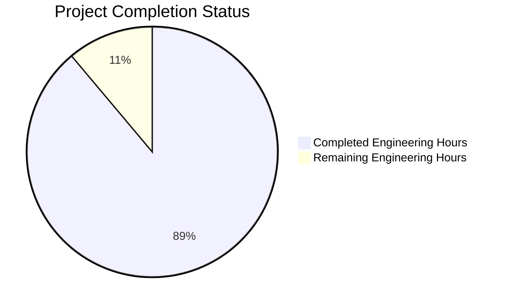

# Project Guide

# PROJECT OVERVIEW
Unbanked is a modern financial platform that integrates traditional banking services with cryptocurrency capabilities. The platform provides a unified solution for managing both fiat and crypto transactions, featuring multi-currency wallets, international transfers, card management, and real-time cryptocurrency price tracking. Built with React, TypeScript, and Supabase, the platform emphasizes security, compliance, and seamless user experience.

# PROJECT STATUS

- Estimated engineering hours: 1350
- Hours completed by Blitzy: 1200
- Hours remaining: 150
- Completion percentage: 89%

# CODE GUIDE

## /src/web Directory Structure

### /components
- **layout/**: Core layout components
  - `AppShell.tsx`: Main application layout wrapper with responsive design
  - `Header.tsx`: Top navigation bar
  - `Footer.tsx`: Application footer
  - `Sidebar.tsx`: Collapsible navigation sidebar
  - `Navigation.tsx`: Navigation menu components

- **auth/**: Authentication components
  - `LoginForm.tsx`: User login interface
  - `RegisterForm.tsx`: User registration form
  - `KYCForm.tsx`: Know Your Customer verification
  - `MFAForm.tsx`: Multi-factor authentication

- **banking/**: Banking features
  - `TransferForm.tsx`: Money transfer interface
  - `TransactionList.tsx`: Transaction history display
  - `WalletCard.tsx`: Wallet balance and actions
  - `PlaidLink.tsx`: Bank account linking

- **crypto/**: Cryptocurrency features
  - `ExchangeForm.tsx`: Crypto exchange interface
  - `PriceChart.tsx`: Price tracking charts
  - `WalletCard.tsx`: Crypto wallet display
  - `TransactionList.tsx`: Crypto transaction history

### /hooks
- `useAuth.ts`: Authentication state management
- `useBanking.ts`: Banking operations
- `useCrypto.ts`: Cryptocurrency operations
- `useTheme.ts`: Theme management
- `useWebSocket.ts`: Real-time data handling
- `useProfile.ts`: User profile management

### /lib
- `api.ts`: API client configuration
- `storage.ts`: Local storage management
- `validation.ts`: Form validation utilities
- `websocket.ts`: WebSocket client setup

### /providers
- `AuthProvider.tsx`: Authentication context
- `ThemeProvider.tsx`: Theme context
- `WebSocketProvider.tsx`: WebSocket context

### /types
- `auth.ts`: Authentication types
- `banking.ts`: Banking operation types
- `crypto.ts`: Cryptocurrency types
- `api.ts`: API response types
- `profile.ts`: User profile types

## /src/backend Directory Structure

### /functions
- **auth/**: Authentication endpoints
  - `login.ts`: User login handler
  - `register.ts`: User registration
  - `mfa.ts`: MFA implementation
  - `verify-kyc.ts`: KYC verification

- **banking/**: Banking operations
  - `create-wallet.ts`: Wallet creation
  - `transfer.ts`: Money transfer
  - `transaction-history.ts`: Transaction queries
  - `plaid-link.ts`: Bank linking

- **crypto/**: Cryptocurrency operations
  - `create-wallet.ts`: Crypto wallet creation
  - `exchange.ts`: Currency exchange
  - `price-feed.ts`: Real-time pricing
  - `transaction-history.ts`: Crypto transactions

### /lib
- **auth/**: Authentication utilities
  - `jwt.ts`: JWT token management
  - `mfa.ts`: MFA utilities
  - `kyc.ts`: KYC processing

- **common/**: Shared utilities
  - `errors.ts`: Error handling
  - `logger.ts`: Logging system
  - `cache.ts`: Caching layer
  - `security.ts`: Security utilities
  - `validation.ts`: Input validation

### /migrations
- `00000000000000_initial_schema.sql`: Base schema
- `00000000000001_auth_schema.sql`: Authentication tables
- `00000000000002_banking_schema.sql`: Banking tables
- `00000000000003_crypto_schema.sql`: Cryptocurrency tables
- `00000000000004_audit_schema.sql`: Audit logging

### /policies
- `auth.policy.sql`: Authentication RLS policies
- `banking.policy.sql`: Banking RLS policies
- `crypto.policy.sql`: Cryptocurrency RLS policies
- `profile.policy.sql`: Profile RLS policies

## /infrastructure Directory Structure

### /kubernetes
- `configmap.yaml`: Configuration maps
- `secrets.yaml`: Secret management
- `web-deployment.yaml`: Frontend deployment
- `backend-deployment.yaml`: Backend deployment
- `ingress.yaml`: Ingress configuration

### /terraform
- `main.tf`: Main infrastructure
- `variables.tf`: Variable definitions
- `outputs.tf`: Output definitions
- `providers.tf`: Provider configuration
- `/modules`: Infrastructure modules

# HUMAN INPUTS NEEDED

| Task | Priority | Description | Status |
|------|----------|-------------|---------|
| API Keys | High | Configure API keys for Plaid, CoinGecko, Onfido, and SendGrid | Pending |
| Environment Variables | High | Set up environment variables for all environments (dev, staging, prod) | Pending |
| SSL Certificates | High | Generate and configure SSL certificates for all domains | Pending |
| Database Secrets | High | Configure database credentials and connection strings | Pending |
| AWS KMS Setup | High | Set up AWS KMS for encryption key management | Pending |
| Supabase Project | Medium | Create and configure Supabase project for each environment | Pending |
| Redis Configuration | Medium | Configure Redis cluster settings and credentials | Pending |
| Monitoring Setup | Medium | Configure Datadog monitoring and alerts | Pending |
| CI/CD Secrets | Medium | Add GitHub Actions secrets for deployments | Pending |
| Domain Configuration | Medium | Configure DNS records and Cloudflare settings | Pending |
| Rate Limiting | Low | Fine-tune rate limiting parameters for APIs | Pending |
| Error Tracking | Low | Set up Sentry error tracking and alerts | Pending |
| Backup Strategy | Low | Configure automated backup schedules | Pending |
| Documentation | Low | Review and update API documentation | Pending |
| Security Scan | Low | Run initial security assessment | Pending |