# Technical Specifications

# 1. INTRODUCTION

## 1.1 EXECUTIVE SUMMARY

Unbanked is a modern financial platform that bridges traditional banking services with cryptocurrency capabilities, providing a comprehensive solution for users seeking integrated financial management. The platform addresses the growing need for seamless interaction between fiat and cryptocurrency transactions while ensuring regulatory compliance and security.

The system serves both retail and business users globally, offering essential banking services like multi-currency wallets, international transfers, and card management alongside cryptocurrency features including exchange integration and real-time price tracking. By combining these capabilities within a unified platform, Unbanked eliminates the complexity and friction typically associated with managing separate traditional and crypto financial services.

## 1.2 SYSTEM OVERVIEW

### Project Context

| Aspect | Description |
|--------|-------------|
| Market Position | First-mover in integrated banking-crypto services with global reach |
| Current Landscape | Fragmented financial services requiring multiple platforms |
| Enterprise Integration | Connects with existing banking infrastructure and crypto networks |

### High-Level Description

| Component | Implementation |
|-----------|---------------|
| Frontend Architecture | React + TypeScript with Vite and Tailwind CSS |
| Backend Infrastructure | Supabase with PostgreSQL and Edge Functions |
| Security Framework | Row Level Security with multi-factor authentication |
| Integration Layer | RESTful APIs and WebSocket connections |

### Success Criteria

| Metric | Target |
|--------|--------|
| User Adoption | 100,000 active users within 6 months |
| Transaction Volume | $10M monthly transaction volume |
| System Uptime | 99.95% availability |
| Response Time | < 500ms for 95% of requests |

## 1.3 SCOPE

### In-Scope Elements

#### Core Features

| Category | Features |
|----------|-----------|
| Authentication | User registration, MFA, KYC verification |
| Banking Services | Multi-currency wallets, transfers, card management |
| Crypto Operations | Wallet management, exchange integration, price tracking |
| Security | Transaction monitoring, audit logging, compliance tracking |

#### Implementation Boundaries

| Boundary Type | Coverage |
|--------------|----------|
| User Groups | Retail users, businesses, administrative staff |
| Geographic Coverage | Global service with regional compliance |
| Data Domains | User profiles, transactions, compliance records, wallet data |
| Technical Scope | Web platform, API services, database systems |

### Out-of-Scope Elements

| Category | Excluded Items |
|----------|---------------|
| Features | - Merchant payment processing<br>- Lending services<br>- Investment portfolio management<br>- Insurance products |
| Technical | - Native mobile applications<br>- Blockchain node operation<br>- Custom hardware wallet integration<br>- Legacy banking system direct integration |
| Markets | - Restricted jurisdictions<br>- Offline banking services |
| Support | - 24/7 phone support<br>- In-person services<br>- Paper-based documentation |

# 2. SYSTEM ARCHITECTURE

## 2.1 High-Level Architecture

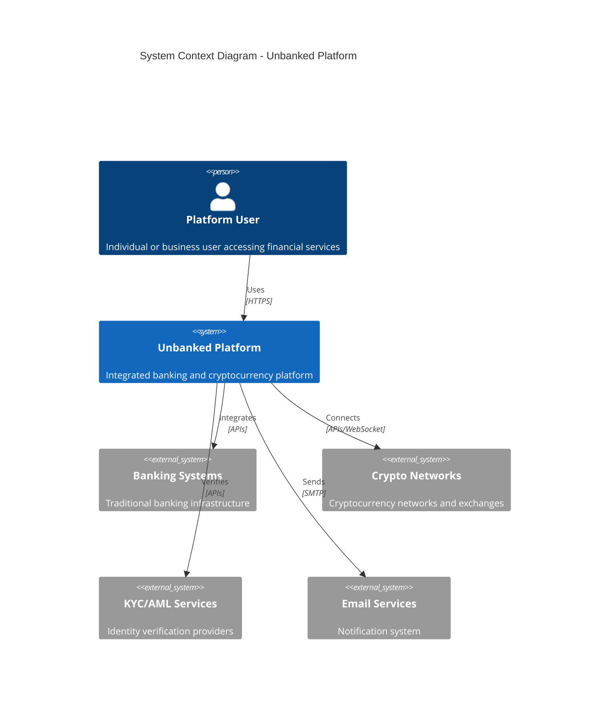

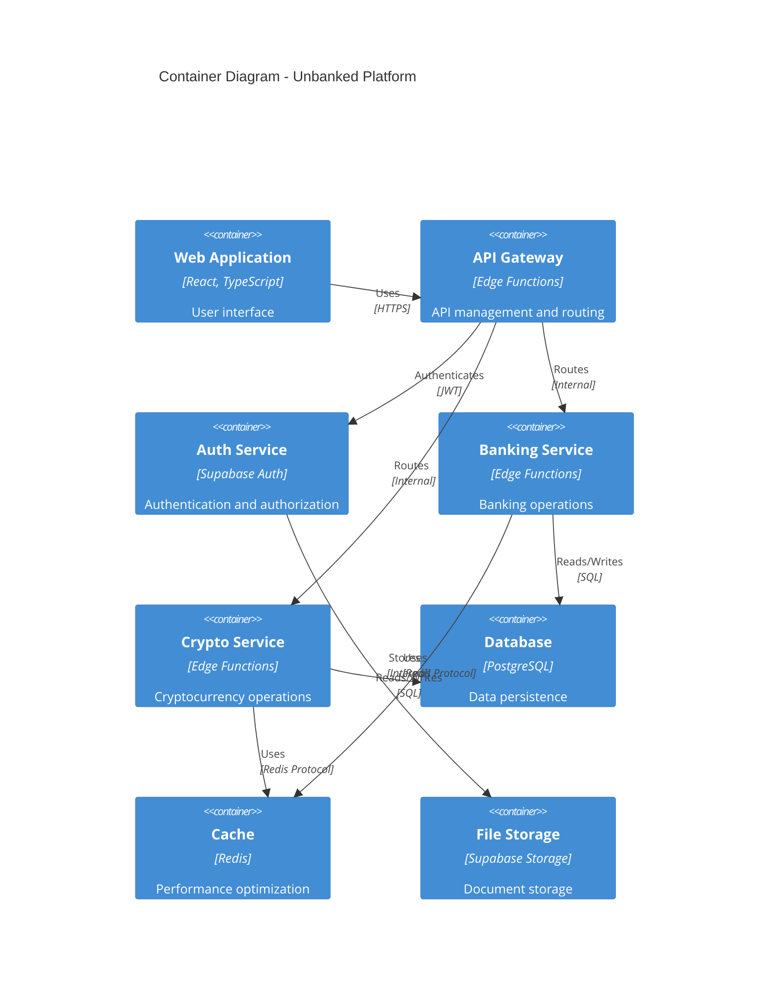

## 2.2 Component Details

### 2.2.1 Frontend Components

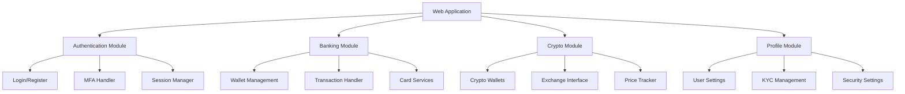

### 2.2.2 Backend Services

| Service | Technology | Purpose | Scaling Strategy |
|---------|------------|---------|------------------|
| API Gateway | Edge Functions | Request routing and validation | Horizontal scaling |
| Auth Service | Supabase Auth | User authentication | Built-in scaling |
| Banking Service | Edge Functions | Banking operations | Auto-scaling |
| Crypto Service | Edge Functions | Cryptocurrency operations | Auto-scaling |
| Database | PostgreSQL | Data persistence | Vertical + Read replicas |
| Cache | Redis | Performance optimization | Cluster mode |
| Storage | Object Storage | Document management | Auto-scaling |

## 2.3 Technical Decisions

### 2.3.1 Architecture Pattern

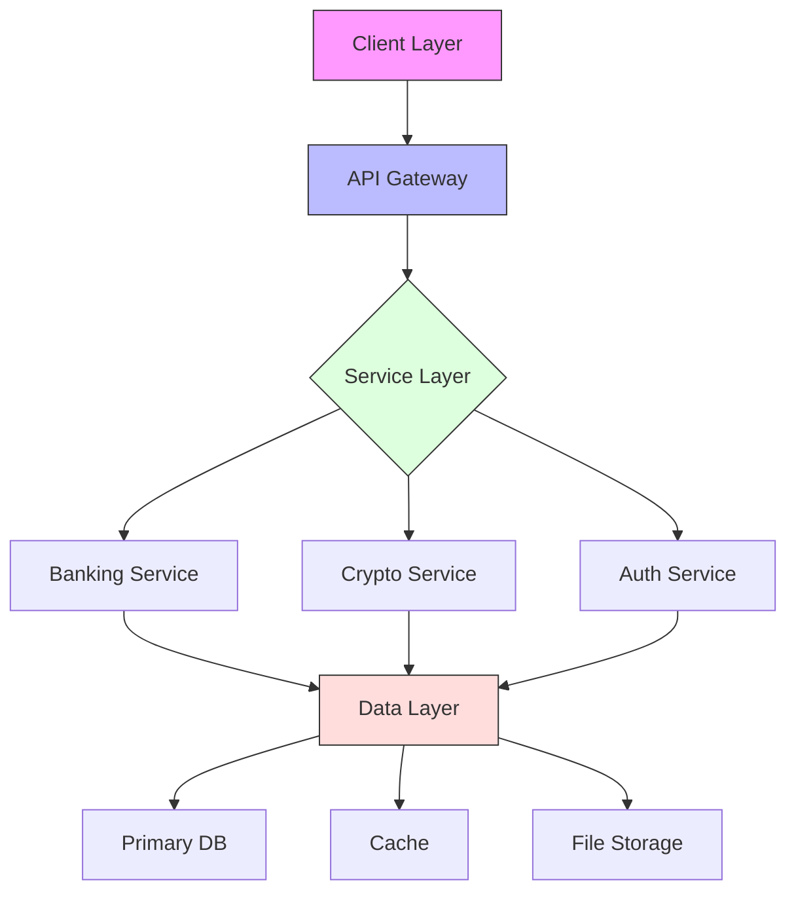

### 2.3.2 Communication Patterns

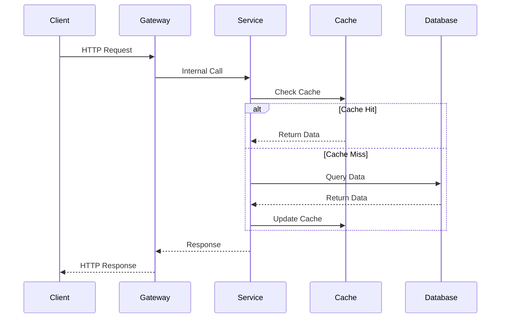

## 2.4 Cross-Cutting Concerns

### 2.4.1 Monitoring and Security

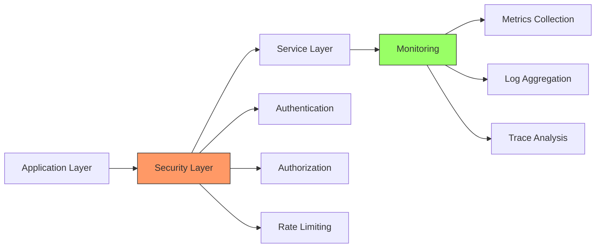

### 2.4.2 Deployment Architecture

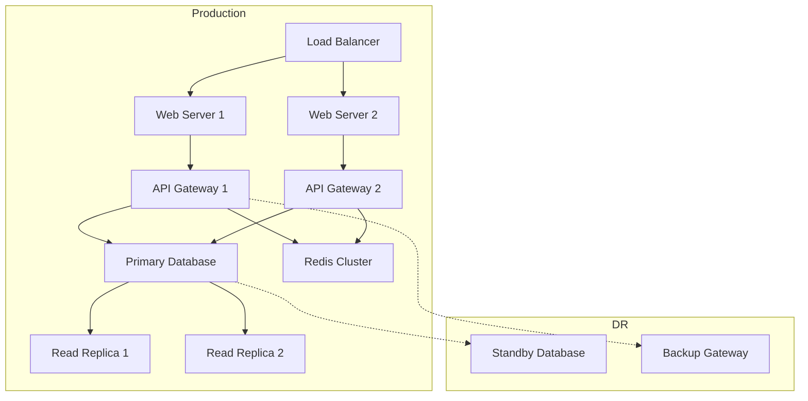

## 2.5 Performance and Scaling

| Component | Scaling Strategy | Performance Target |
|-----------|-----------------|-------------------|
| Frontend | CDN + Edge Caching | < 2s load time |
| API Gateway | Horizontal + Load Balancing | < 100ms latency |
| Services | Auto-scaling | < 500ms response |
| Database | Read Replicas + Sharding | < 100ms query time |
| Cache | Cluster + Eviction | < 10ms response |
| Storage | Distributed System | < 200ms access time |

# 3. SYSTEM COMPONENTS ARCHITECTURE

## 3.1 USER INTERFACE DESIGN

### 3.1.1 Design Specifications

| Aspect | Requirement | Implementation |
|--------|-------------|----------------|
| Visual Hierarchy | Material Design principles | shadcn/ui component library |
| Responsive Design | Mobile-first approach | Tailwind CSS breakpoints |
| Accessibility | WCAG 2.1 Level AA | ARIA labels, semantic HTML |
| Browser Support | Modern browsers, IE11+ | Babel polyfills, PostCSS |
| Theme Support | Dark/Light modes | CSS variables, Tailwind themes |
| Internationalization | RTL support, 10+ languages | i18next, React-Intl |

### 3.1.2 Component Architecture

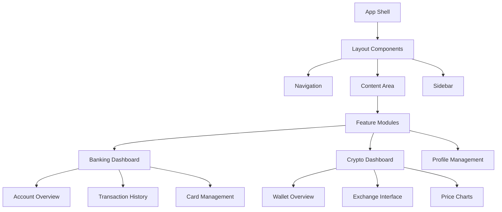

### 3.1.3 Critical User Flows

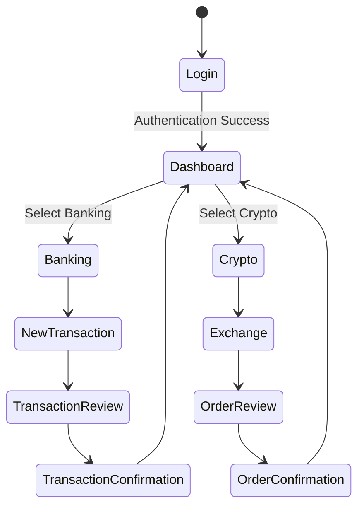

## 3.2 DATABASE DESIGN

### 3.2.1 Schema Design

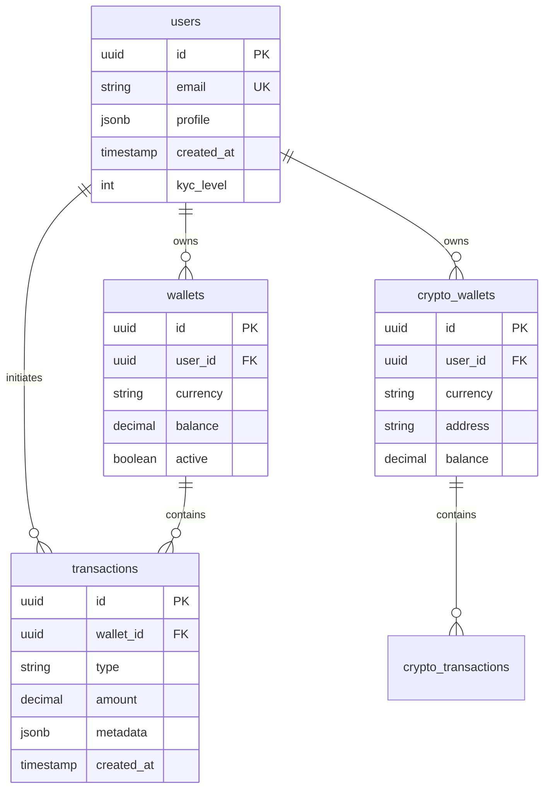

### 3.2.2 Data Management Strategy

| Aspect | Strategy | Implementation |
|--------|----------|----------------|
| Partitioning | Time-based partitioning | Monthly transaction partitions |
| Indexing | Composite indexes | B-tree indexes on frequent queries |
| Caching | Multi-level caching | Redis + PostgreSQL materialized views |
| Backup | Continuous backup | Point-in-time recovery enabled |
| Archival | Cold storage policy | Move data older than 6 months |
| Encryption | Column-level encryption | AES-256 for sensitive data |

### 3.2.3 Performance Optimization

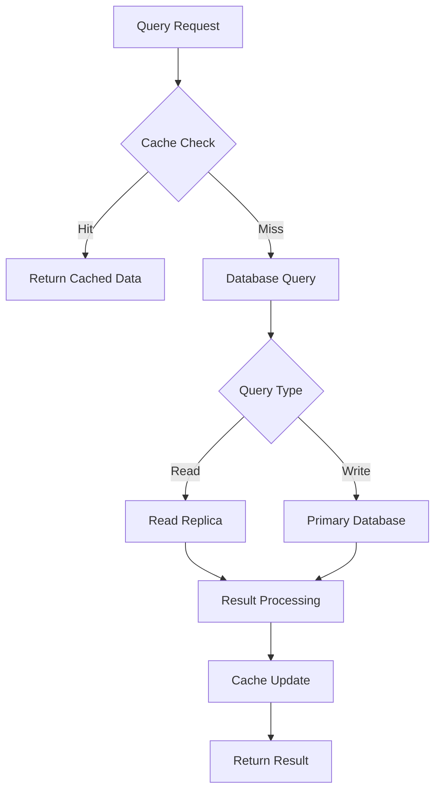

## 3.3 API DESIGN

### 3.3.1 API Architecture

| Component | Specification | Implementation |
|-----------|--------------|----------------|
| Protocol | REST + WebSocket | HTTPS/WSS |
| Authentication | OAuth 2.0 + JWT | Supabase Auth |
| Rate Limiting | Token bucket algorithm | 1000 req/min per user |
| Versioning | URI versioning | /v1/resource |
| Documentation | OpenAPI 3.0 | Swagger UI |
| Security | TLS 1.3 | Let's Encrypt certificates |

### 3.3.2 API Flow Patterns

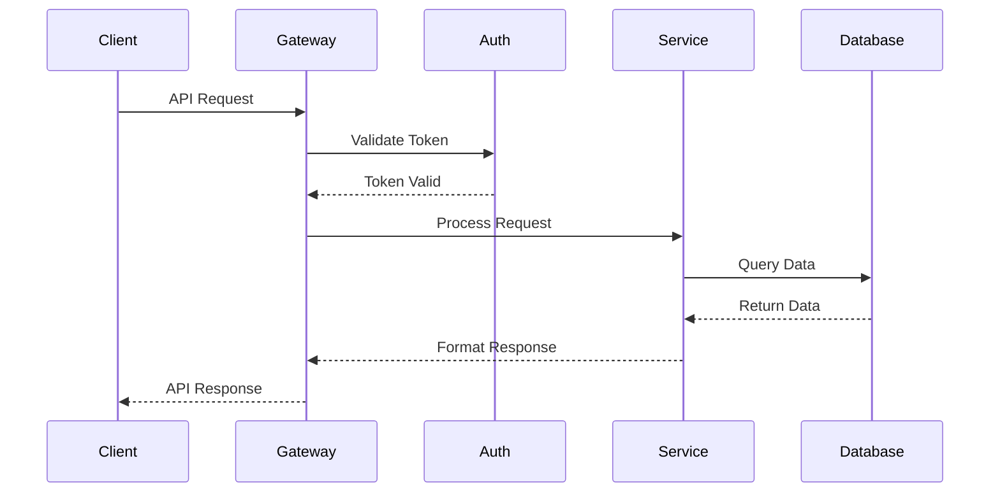

### 3.3.3 Integration Architecture

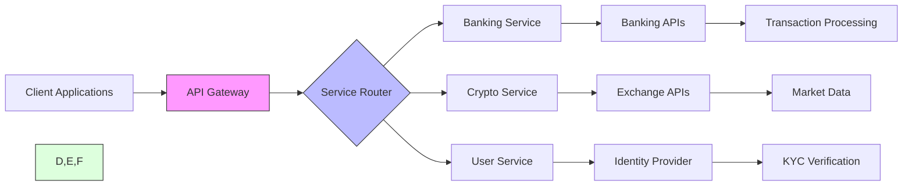

# 4. TECHNOLOGY STACK

## 4.1 PROGRAMMING LANGUAGES

| Platform | Language | Version | Justification |
|----------|----------|---------|---------------|
| Frontend | TypeScript | 5.0+ | Type safety, better IDE support, reduced runtime errors |
| Backend | TypeScript | 5.0+ | Code sharing with frontend, consistent development experience |
| Edge Functions | TypeScript | 5.0+ | Native Supabase support, optimal performance |
| Database Functions | PL/pgSQL | 15+ | Native PostgreSQL procedural language for optimal performance |
| Build Scripts | Node.js | 18+ LTS | Ecosystem compatibility, stable LTS support |

## 4.2 FRAMEWORKS & LIBRARIES

### Core Frameworks

| Component | Framework | Version | Justification |
|-----------|-----------|---------|---------------|
| Frontend Framework | React | 18.2+ | Component reusability, virtual DOM performance |
| Build Tool | Vite | 4.0+ | Fast HMR, optimized build performance |
| CSS Framework | Tailwind CSS | 3.0+ | Utility-first approach, minimal bundle size |
| UI Components | shadcn/ui | 1.0+ | Accessible, customizable components |
| State Management | React Query | 4.0+ | Server state management, caching capabilities |

### Supporting Libraries

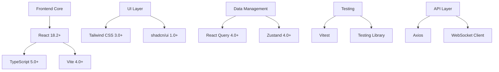

## 4.3 DATABASES & STORAGE

### Primary Database

| Component | Technology | Purpose |
|-----------|------------|----------|
| Main Database | PostgreSQL 15+ | Primary data store |
| Real-time | Supabase Realtime | Live updates and subscriptions |
| Cache Layer | Redis 7+ | Session and application cache |
| File Storage | Supabase Storage | Document and media storage |

### Data Architecture

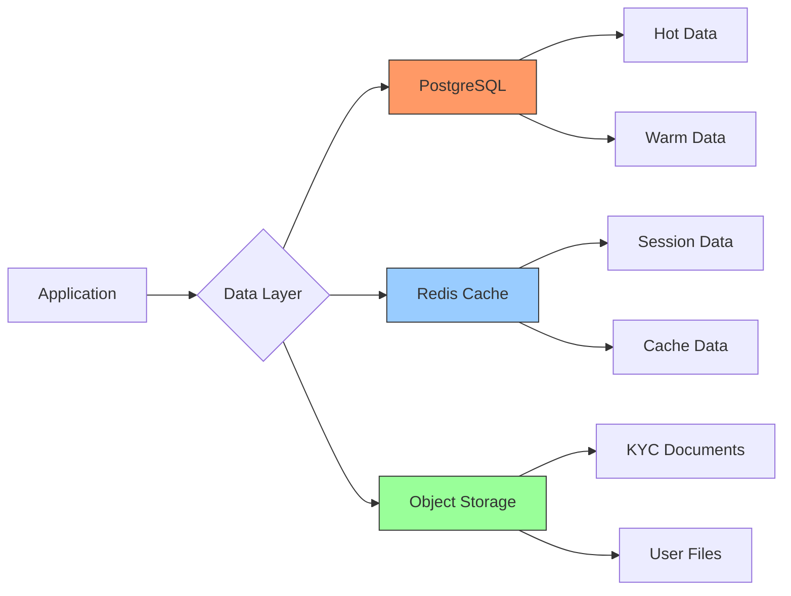

## 4.4 THIRD-PARTY SERVICES

| Category | Service | Purpose | Integration Method |
|----------|---------|---------|-------------------|
| Authentication | Supabase Auth | User authentication | Native SDK |
| KYC/AML | Onfido | Identity verification | REST API |
| Banking | Plaid | Bank connections | REST API |
| Crypto | CoinGecko | Price data | REST API |
| Email | SendGrid | Transactional emails | SMTP/REST |
| Monitoring | Datadog | System monitoring | Agent/API |

## 4.5 DEVELOPMENT & DEPLOYMENT

### Development Environment

| Tool | Purpose | Version |
|------|---------|---------|
| VS Code | IDE | Latest |
| ESLint | Code linting | 8.0+ |
| Prettier | Code formatting | 3.0+ |
| Husky | Git hooks | 8.0+ |
| pnpm | Package management | 8.0+ |

### Deployment Pipeline

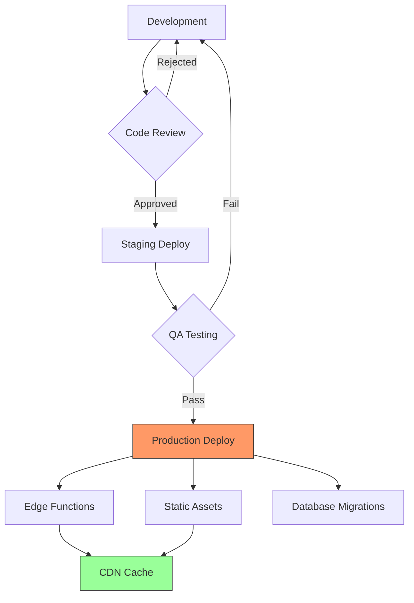

### Infrastructure Requirements

| Component | Specification | Scaling Strategy |
|-----------|--------------|------------------|
| Edge Functions | Supabase Compute | Auto-scaling |
| Database | Dedicated Instance | Vertical + Read replicas |
| Storage | S3-compatible | Auto-scaling |
| CDN | Cloudflare Enterprise | Global distribution |
| Cache | Redis Cluster | Memory-based scaling |

# 5. SYSTEM DESIGN

## 5.1 USER INTERFACE DESIGN

### 5.1.1 Layout Structure

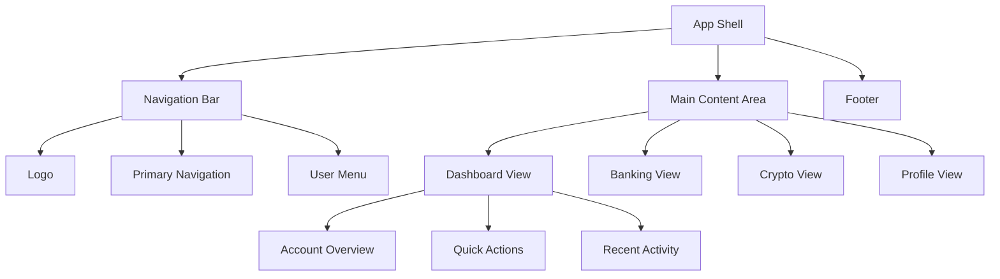

### 5.1.2 Component Hierarchy

| Component | Children | State Management |
|-----------|----------|------------------|
| AppShell | Navigation, MainContent, Footer | Global Layout State |
| Navigation | Logo, NavLinks, UserMenu | Authentication State |
| Dashboard | AccountSummary, ActionCards, ActivityFeed | Account Data |
| Banking | WalletList, TransactionHistory, Cards | Banking State |
| Crypto | CryptoWallets, Exchange, PriceCharts | Crypto State |
| Profile | PersonalInfo, Security, Preferences | User Profile State |

### 5.1.3 Responsive Breakpoints

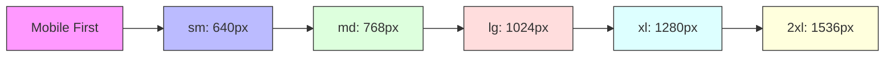

## 5.2 DATABASE DESIGN

### 5.2.1 Schema Design


### 5.2.2 Data Access Patterns

| Access Pattern | Implementation | Optimization |
|----------------|----------------|--------------|
| User Profile | Direct UUID Lookup | Primary Key Index |
| Transaction History | Time-based Query | Composite Index (user_id, created_at) |
| Wallet Balances | Materialized View | Hourly Refresh |
| Activity Feed | Real-time Subscription | Change Data Capture |
| KYC Status | Cached Lookup | Redis Cache Layer |

### 5.2.3 Row Level Security Policies

```sql
-- Users table RLS
ALTER TABLE users ENABLE ROW LEVEL SECURITY;
CREATE POLICY "Users can only view own profile"
    ON users FOR SELECT
    USING (auth.uid() = id);

-- Wallets table RLS
ALTER TABLE wallets ENABLE ROW LEVEL SECURITY;
CREATE POLICY "Users can only access own wallets"
    ON wallets FOR ALL
    USING (auth.uid() = user_id);
```

## 5.3 API DESIGN

### 5.3.1 REST Endpoints

| Endpoint | Method | Purpose | Authentication |
|----------|---------|---------|----------------|
| /api/v1/auth | POST | User authentication | Public |
| /api/v1/wallets | GET | List user wallets | JWT Required |
| /api/v1/transactions | POST | Create transaction | JWT + 2FA |
| /api/v1/crypto/exchange | POST | Execute exchange | JWT + 2FA |
| /api/v1/profile | PUT | Update profile | JWT Required |

### 5.3.2 WebSocket Events

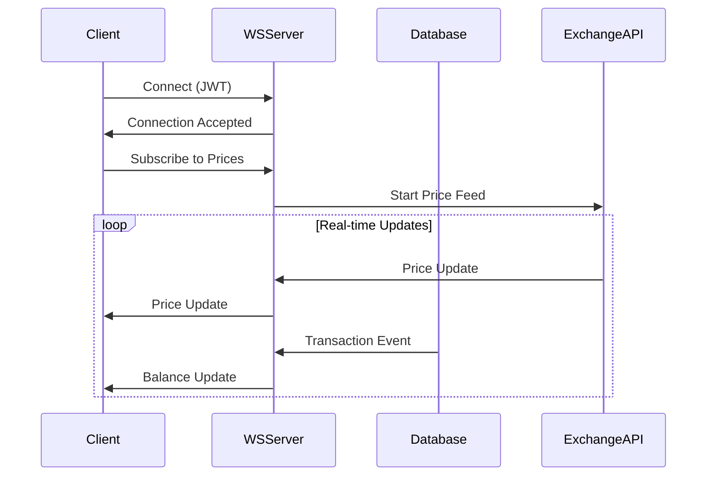

### 5.3.3 API Response Format

```json
{
  "status": "success",
  "data": {
    "id": "uuid",
    "type": "transaction",
    "attributes": {
      "amount": "100.00",
      "currency": "USD",
      "status": "completed"
    },
    "relationships": {
      "wallet": {
        "id": "wallet-uuid",
        "type": "wallet"
      }
    }
  },
  "meta": {
    "timestamp": "2023-01-01T00:00:00Z"
  }
}
```

### 5.3.4 Error Handling

| Error Code | Description | Response Format |
|------------|-------------|-----------------|
| 400 | Bad Request | {"error": "validation_failed", "details": {...}} |
| 401 | Unauthorized | {"error": "unauthorized", "message": "..."} |
| 403 | Forbidden | {"error": "forbidden", "message": "..."} |
| 404 | Not Found | {"error": "not_found", "resource": "..."} |
| 429 | Rate Limited | {"error": "rate_limit", "retry_after": 60} |

### 5.3.5 API Security

```mermaid
flowchart TD
    A[API Request] --> B{JWT Valid?}
    B -->|No| C[401 Unauthorized]
    B -->|Yes| D{Rate Limit OK?}
    
    D -->|No| E[429 Too Many Requests]
    D -->|Yes| F{Permission Check}
    
    F -->|Fail| G[403 Forbidden]
    F -->|Pass| H{2FA Required?}
    
    H -->|Yes| I[2FA Challenge]
    H -->|No| J[Process Request]
    
    I -->|Valid| J
    I -->|Invalid| C
    
    style B fill:#f96,stroke:#333
    style F fill:#9f6,stroke:#333
    style H fill:#69f,stroke:#333
```

# 6. USER INTERFACE DESIGN

## 6.1 Design System

| Component | Framework | Implementation |
|-----------|-----------|----------------|
| Base Framework | React + TypeScript | Functional components with hooks |
| UI Library | shadcn/ui | Customized with Tailwind CSS |
| Styling | Tailwind CSS | Utility-first responsive design |
| Icons | Lucide Icons | Consistent icon system |
| Typography | Inter | Variable font with weights 400-700 |

## 6.2 Layout Structure

```
+----------------------------------------------------------+
|                      [#] Unbanked                    [@]   |
+----------------------------------------------------------+
|  +----------------+  +----------------------------------+ |
|  | [#] Dashboard  |  |        Account Overview          | |
|  | [$] Banking    |  | +-------------+ +-------------+ | |
|  | [*] Crypto     |  | | Fiat Balance| |Crypto Value | | |
|  | [@] Profile    |  | | $10,000 USD | | 2.5 BTC    | | |
|  | [=] Settings   |  | +-------------+ +-------------+ | |
|  +----------------+  +----------------------------------+ |
|                     |        Quick Actions              | |
|                     | [Send] [Receive] [Exchange] [Buy] | |
|                     +----------------------------------+ |
+----------------------------------------------------------+
```

## 6.3 Key Screens

### 6.3.1 Banking Dashboard

```
+----------------------------------------------------------+
|  [$] Banking                                    [?] Help   |
+----------------------------------------------------------+
|  Available Balance                                         |
|  $10,000.00 USD                                           |
|  +------------------+  +------------------+                |
|  | [+] Add Funds    |  | [-] Send Money   |                |
|  +------------------+  +------------------+                |
|                                                           |
|  Recent Transactions                                      |
|  +--------------------------------------------------+    |
|  | Date       | Description        | Amount          |    |
|  |------------+-------------------+------------------|    |
|  | 2024-01-20 | Coffee Shop       | -$4.50          |    |
|  | 2024-01-19 | Salary Deposit    | +$3,000.00      |    |
|  | 2024-01-18 | Online Transfer   | -$150.00        |    |
|  +--------------------------------------------------+    |
|                                                           |
|  [Load More Transactions...]                              |
+----------------------------------------------------------+
```

### 6.3.2 Crypto Exchange

```
+----------------------------------------------------------+
|  [*] Exchange                                   [?] Help   |
+----------------------------------------------------------+
|  From:                        To:                          |
|  +--------------------+      +--------------------+        |
|  | Amount: [...1.0...]|      | Receive: ~34,500  |        |
|  | Currency: [v BTC]  |      | Currency: [v USD] |        |
|  +--------------------+      +--------------------+        |
|                                                           |
|  Exchange Rate: 1 BTC = $34,500 USD                       |
|  Fee: 0.1% ($34.50)                                       |
|                                                           |
|  [Review Exchange]                                        |
|                                                           |
|  Market Prices                                            |
|  +--------------------------------------------------+    |
|  | Currency | Price (USD) | 24h Change              |    |
|  |----------+-------------+-------------------------|    |
|  | BTC      | $34,500     | [↑] +2.5%              |    |
|  | ETH      | $2,300      | [↓] -1.2%              |    |
|  +--------------------------------------------------+    |
+----------------------------------------------------------+
```

### 6.3.3 Profile & KYC

```
+----------------------------------------------------------+
|  [@] Profile                                    [?] Help   |
+----------------------------------------------------------+
|  Verification Status: Level 2                              |
|  [====================================] 80% Complete       |
|                                                           |
|  Personal Information                                     |
|  +--------------------------------------------------+    |
|  | Full Name: [...John Doe........................] |    |
|  | Email: [...john.doe@email.com..................] |    |
|  | Phone: [...+1 (555) 123-4567..................] |    |
|  +--------------------------------------------------+    |
|                                                           |
|  Required Documents                                       |
|  [x] Government ID      [Verified]                        |
|  [x] Proof of Address   [Verified]                        |
|  [ ] Bank Statement     [^] Upload                        |
|                                                           |
|  [Save Changes]                                           |
+----------------------------------------------------------+
```

## 6.4 Component Legend

| Symbol | Meaning |
|--------|---------|
| [#] | Dashboard/Menu icon |
| [$] | Financial/Banking section |
| [*] | Crypto/Trading section |
| [@] | User/Profile section |
| [=] | Settings menu |
| [?] | Help/Support |
| [+] | Add/Create action |
| [-] | Remove/Send action |
| [^] | Upload function |
| [...] | Text input field |
| [v] | Dropdown selector |
| [x] | Completed/Verified |
| [====] | Progress indicator |
| [↑] | Positive change |
| [↓] | Negative change |

## 6.5 Responsive Breakpoints

| Breakpoint | Layout Changes |
|------------|---------------|
| < 640px | Single column, stacked components |
| ≥ 640px | Two column layout begins |
| ≥ 768px | Side navigation visible |
| ≥ 1024px | Full desktop experience |
| ≥ 1280px | Extended dashboard widgets |

## 6.6 Interaction States

| State | Visual Indicator |
|-------|-----------------|
| Hover | Background color change |
| Active | Border highlight |
| Loading | Spinner animation |
| Error | Red border + message |
| Success | Green checkmark |
| Disabled | Reduced opacity |

## 6.7 Accessibility Features

| Feature | Implementation |
|---------|---------------|
| Keyboard Navigation | Full tab index support |
| Screen Readers | ARIA labels and roles |
| Color Contrast | WCAG 2.1 AA compliant |
| Text Scaling | Supports 200% zoom |
| Focus Indicators | Visible outlines |
| Error Messages | Icon + color + text |

# 7. SECURITY CONSIDERATIONS

## 7.1 AUTHENTICATION AND AUTHORIZATION

### 7.1.1 Authentication Flow

```mermaid
sequenceDiagram
    participant User
    participant Frontend
    participant Supabase Auth
    participant Database
    participant MFA Service

    User->>Frontend: Login Request
    Frontend->>Supabase Auth: Authenticate
    Supabase Auth->>Database: Verify Credentials
    
    alt Valid Credentials
        Database-->>Supabase Auth: User Found
        Supabase Auth->>MFA Service: Request 2FA
        MFA Service->>Frontend: 2FA Challenge
        Frontend->>User: Present 2FA Input
        User->>Frontend: Submit 2FA Code
        Frontend->>MFA Service: Verify 2FA
        
        alt Valid 2FA
            MFA Service-->>Supabase Auth: 2FA Valid
            Supabase Auth-->>Frontend: JWT Token
            Frontend-->>User: Access Granted
        else Invalid 2FA
            MFA Service-->>Frontend: 2FA Failed
            Frontend-->>User: Authentication Failed
        end
        
    else Invalid Credentials
        Database-->>Supabase Auth: User Not Found
        Supabase Auth-->>Frontend: Authentication Failed
        Frontend-->>User: Invalid Credentials
    end
```

### 7.1.2 Authorization Matrix

| Role | Banking Operations | Crypto Operations | Profile Management | Admin Functions |
|------|-------------------|-------------------|-------------------|-----------------|
| User Level 1 | View Only | Disabled | Basic Profile | None |
| User Level 2 | Up to $1,000/day | Basic Trading | Full Profile | None |
| User Level 3 | Up to $10,000/day | Full Trading | Full Profile + API | None |
| Support Staff | View Only | View Only | View Only | Limited |
| Administrator | Full Access | Full Access | Full Access | Full Access |

### 7.1.3 Session Management

| Feature | Implementation |
|---------|---------------|
| Token Type | JWT with RS256 |
| Token Expiry | 15 minutes |
| Refresh Token | 7 days |
| Concurrent Sessions | Maximum 3 devices |
| Session Monitoring | Real-time activity tracking |
| Force Logout | Available for suspicious activity |

## 7.2 DATA SECURITY

### 7.2.1 Encryption Strategy

```mermaid
flowchart TD
    A[Data Input] --> B{Classification}
    B -->|Sensitive| C[Field Level Encryption]
    B -->|PII| D[Column Encryption]
    B -->|Standard| E[TLS Protection]
    
    C --> F[AES-256-GCM]
    D --> G[pgcrypto]
    E --> H[TLS 1.3]
    
    F --> I[Encrypted Storage]
    G --> I
    H --> J[Secure Transport]
    
    I --> K[Key Management]
    K --> L[AWS KMS]
    K --> M[Key Rotation]
```

### 7.2.2 Data Protection Measures

| Data Type | Protection Method | Key Management |
|-----------|------------------|----------------|
| User Credentials | Argon2id hashing | N/A |
| PII Data | AES-256-GCM | AWS KMS |
| Financial Data | Column-level encryption | AWS KMS |
| Session Data | Redis encryption | Runtime keys |
| API Keys | Hash-based tokens | Vault storage |
| KYC Documents | Encrypted object storage | AWS KMS |

### 7.2.3 Database Security

| Security Layer | Implementation | Purpose |
|----------------|----------------|----------|
| Row Level Security | Supabase RLS Policies | Data access control |
| Connection Security | TLS 1.3 | Transport encryption |
| Audit Logging | PostgreSQL audit extension | Activity tracking |
| Backup Encryption | AES-256 | Backup protection |
| Query Analysis | Real-time SQL monitoring | Injection prevention |

## 7.3 SECURITY PROTOCOLS

### 7.3.1 Network Security

```mermaid
flowchart LR
    A[Internet] --> B[Cloudflare WAF]
    B --> C[Load Balancer]
    C --> D[Edge Functions]
    D --> E[Application Layer]
    E --> F[Database Layer]
    
    G[Security Monitoring] --> B
    G --> C
    G --> D
    G --> E
    G --> F
    
    style B fill:#f96,stroke:#333
    style G fill:#96f,stroke:#333
```

### 7.3.2 Security Controls

| Control Type | Implementation | Monitoring |
|--------------|----------------|------------|
| WAF | Cloudflare Enterprise | Real-time |
| DDoS Protection | Cloudflare + Rate Limiting | Automated |
| IP Filtering | Geolocation-based rules | Real-time |
| SSL/TLS | Let's Encrypt + Cloudflare | Daily scan |
| Vulnerability Scanning | Weekly automated scans | Scheduled |
| Penetration Testing | Quarterly assessments | Manual |

### 7.3.3 Incident Response

| Phase | Actions | Timeframe |
|-------|---------|-----------|
| Detection | Automated monitoring alerts | Real-time |
| Analysis | Security team investigation | < 15 minutes |
| Containment | Automated + manual response | < 30 minutes |
| Eradication | Threat removal and patching | < 2 hours |
| Recovery | Service restoration | < 4 hours |
| Post-Incident | Analysis and reporting | < 24 hours |

### 7.3.4 Compliance Monitoring

| Requirement | Monitoring Method | Frequency |
|-------------|------------------|-----------|
| Access Logs | Real-time analysis | Continuous |
| User Activity | Behavior analysis | Real-time |
| Transaction Patterns | ML-based detection | Real-time |
| System Changes | Change management logs | Daily review |
| Security Events | SIEM integration | Real-time |
| Compliance Reports | Automated generation | Monthly |

# 8. INFRASTRUCTURE

## 8.1 DEPLOYMENT ENVIRONMENT

| Environment | Purpose | Configuration |
|------------|----------|---------------|
| Development | Local development and testing | Docker containers on developer machines |
| Staging | Pre-production testing and QA | Supabase Platform (Staging Project) |
| Production | Live application environment | Supabase Enterprise + Multi-region deployment |
| DR | Disaster recovery environment | Cross-region failover configuration |

### Environment Architecture

```mermaid
flowchart TD
    subgraph Production
        A[Load Balancer] --> B1[Edge Function Region 1]
        A --> B2[Edge Function Region 2]
        
        B1 --> C1[Primary Database]
        B2 --> C1
        
        C1 --> D1[Read Replica 1]
        C1 --> D2[Read Replica 2]
        
        E[Redis Cluster] --> B1
        E --> B2
    end
    
    subgraph DR[Disaster Recovery]
        F[Standby Load Balancer]
        G[DR Database]
        H[DR Redis Cluster]
    end
    
    C1 -.->|Continuous Replication| G
    E -.->|Async Replication| H
```

## 8.2 CLOUD SERVICES

| Service | Provider | Purpose | Justification |
|---------|----------|---------|---------------|
| Edge Functions | Supabase | Serverless compute | Global distribution, low latency |
| Database | Supabase | Data storage | Built-in RLS, real-time capabilities |
| Object Storage | Supabase Storage | File storage | Integrated with RLS, scalable |
| CDN | Cloudflare Enterprise | Content delivery | Global presence, DDoS protection |
| KMS | AWS KMS | Key management | Industry standard, HSM backing |
| Monitoring | Datadog | System monitoring | Comprehensive observability |
| Error Tracking | Sentry | Error reporting | React integration, detailed stack traces |

## 8.3 CONTAINERIZATION

### Container Architecture

```mermaid
graph TD
    A[Docker Compose] --> B[Frontend Container]
    A --> C[Development Tools]
    
    B --> D[Node.js Runtime]
    B --> E[Vite Dev Server]
    
    C --> F[PostgreSQL]
    C --> G[Redis]
    C --> H[Mailhog]
    
    style A fill:#f96,stroke:#333
    style B fill:#9f6,stroke:#333
    style C fill:#69f,stroke:#333
```

### Container Specifications

| Container | Base Image | Purpose |
|-----------|------------|---------|
| Frontend | node:18-alpine | Development environment |
| PostgreSQL | postgres:15-alpine | Local database |
| Redis | redis:7-alpine | Local caching |
| Mailhog | mailhog/mailhog | Email testing |

## 8.4 ORCHESTRATION

| Component | Implementation | Purpose |
|-----------|----------------|----------|
| Service Discovery | Supabase Platform | Edge function routing |
| Load Balancing | Cloudflare Load Balancing | Global traffic distribution |
| Auto Scaling | Supabase Auto-scale | Resource management |
| Health Checks | Custom health endpoints | Service monitoring |
| Failover | Cross-region automation | High availability |

## 8.5 CI/CD PIPELINE

### Pipeline Architecture

```mermaid
flowchart LR
    A[GitHub Repository] --> B{GitHub Actions}
    B --> C[Code Quality]
    B --> D[Testing]
    B --> E[Security Scan]
    
    C --> F[Build Stage]
    D --> F
    E --> F
    
    F --> G{Deploy Branch}
    G -->|main| H[Production]
    G -->|staging| I[Staging]
    G -->|develop| J[Development]
    
    H --> K[Post-Deploy Tests]
    I --> K
    
    style B fill:#f96,stroke:#333
    style F fill:#9f6,stroke:#333
    style G fill:#69f,stroke:#333
```

### Pipeline Stages

| Stage | Tools | Actions |
|-------|-------|---------|
| Code Quality | ESLint, Prettier | Style checking, formatting |
| Testing | Vitest, Playwright | Unit tests, E2E tests |
| Security | Snyk, OWASP Dependency Check | Vulnerability scanning |
| Build | Vite | Production build creation |
| Deployment | Supabase CLI | Database migrations, Edge Functions deployment |
| Verification | Checkly | Post-deployment testing |

### Deployment Strategy

| Environment | Strategy | Rollback Plan |
|-------------|----------|---------------|
| Development | Direct deployment | Manual revert |
| Staging | Blue-green deployment | Automatic rollback |
| Production | Canary deployment | Automated failback |
| Database | Migration with dry-run | Point-in-time recovery |

# 8. APPENDICES

## 8.1 ADDITIONAL TECHNICAL INFORMATION

### 8.1.1 Database Partitioning Strategy

```mermaid
flowchart TD
    A[Transaction Data] --> B{Age-based Partitioning}
    B -->|< 3 months| C[Hot Partition]
    B -->|3-12 months| D[Warm Partition]
    B -->|> 12 months| E[Cold Partition]
    
    C --> F[High-Performance Storage]
    D --> G[Standard Storage]
    E --> H[Archive Storage]
    
    style C fill:#f96,stroke:#333
    style D fill:#ff9,stroke:#333
    style E fill:#9cf,stroke:#333
```

### 8.1.2 Cache Invalidation Rules

| Cache Type | TTL | Invalidation Trigger |
|------------|-----|---------------------|
| User Profile | 15 minutes | Profile update |
| Wallet Balance | 1 minute | Transaction completion |
| Exchange Rates | 30 seconds | Price update |
| KYC Status | 1 hour | Verification change |
| Transaction History | 5 minutes | New transaction |

### 8.1.3 Edge Function Deployment Regions

| Region | Purpose | Failover Region |
|--------|---------|----------------|
| us-east-1 | Primary US | us-west-2 |
| eu-west-1 | Primary EU | eu-central-1 |
| ap-southeast-1 | Primary APAC | ap-northeast-1 |
| sa-east-1 | Primary LATAM | us-east-1 |

## 8.2 GLOSSARY

| Term | Definition |
|------|------------|
| Edge Functions | Serverless functions that run at CDN edge locations |
| Hot Partition | Database partition containing frequently accessed recent data |
| Warm Partition | Database partition containing moderately accessed data |
| Cold Partition | Database partition containing rarely accessed historical data |
| Liquidity Pool | Smart contract-based fund pool for cryptocurrency trading |
| Gas Fee | Transaction fee for blockchain operations |
| Custodial Wallet | Platform-managed cryptocurrency wallet |
| Non-Custodial Wallet | User-controlled cryptocurrency wallet |
| Row Level Security | Database access control at row level |
| WebSocket | Protocol for full-duplex communication channels |
| JWT | Token-based authentication mechanism |
| Materialized View | Pre-computed database view for performance optimization |
| Change Data Capture | System for tracking database changes in real-time |
| Point-in-Time Recovery | Database recovery to specific timestamp |

## 8.3 ACRONYMS

| Acronym | Full Form |
|---------|-----------|
| AML | Anti-Money Laundering |
| API | Application Programming Interface |
| CCPA | California Consumer Privacy Act |
| CDN | Content Delivery Network |
| GDPR | General Data Protection Regulation |
| HSM | Hardware Security Module |
| JWT | JSON Web Token |
| KMS | Key Management Service |
| KYC | Know Your Customer |
| MFA | Multi-Factor Authentication |
| PII | Personally Identifiable Information |
| RLS | Row Level Security |
| SMTP | Simple Mail Transfer Protocol |
| SQL | Structured Query Language |
| SSL | Secure Sockets Layer |
| TOTP | Time-based One-Time Password |
| TLS | Transport Layer Security |
| UI | User Interface |
| UUID | Universally Unique Identifier |
| WSS | WebSocket Secure |
| WCAG | Web Content Accessibility Guidelines |
| XSS | Cross-Site Scripting |
| YAML | YAML Ain't Markup Language |
| 2FA | Two-Factor Authentication |

## 8.4 REFERENCE ARCHITECTURE

```mermaid
flowchart TD
    A[Client Layer] --> B[CDN/Edge]
    B --> C[API Gateway]
    
    C --> D[Edge Functions]
    C --> E[WebSocket Server]
    
    D --> F[Database]
    D --> G[Cache]
    D --> H[Storage]
    
    E --> G
    E --> F
    
    I[External Services] --> D
    
    style B fill:#f96,stroke:#333
    style D fill:#9f6,stroke:#333
    style G fill:#69f,stroke:#333
```

## 8.5 COMPLIANCE MATRIX

| Requirement | Standard | Implementation | Verification |
|------------|----------|----------------|--------------|
| Data Protection | GDPR | Encryption, RLS | Audit logs |
| Authentication | NIST 800-63 | MFA, JWT | Security testing |
| Financial | PSD2 | API security | Penetration testing |
| Accessibility | WCAG 2.1 | UI components | Automated testing |
| Security | ISO 27001 | Security controls | Regular audits |
| Privacy | CCPA | Data handling | Compliance review |