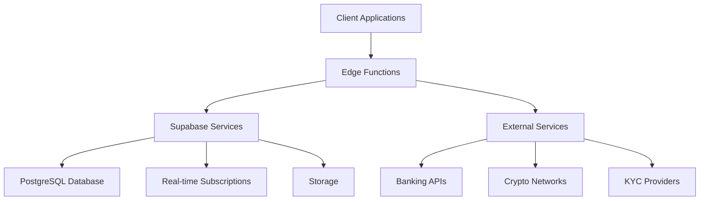
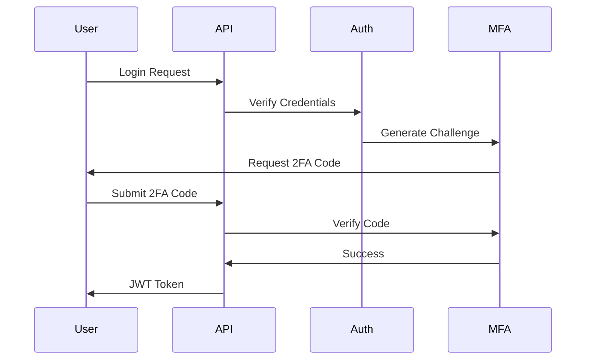

# Unbanked Platform Backend Services

Comprehensive backend infrastructure documentation for the Unbanked financial platform, built with Supabase, PostgreSQL, and Edge Functions.

## Overview

### Project Description
Unbanked is a modern financial platform integrating traditional banking with cryptocurrency capabilities. The backend infrastructure provides secure, scalable services supporting multi-currency wallets, international transfers, and cryptocurrency operations.

### Architecture


### Technology Stack
- **Runtime**: Node.js ≥18.0.0
- **Package Manager**: pnpm ≥8.0.0
- **Database**: PostgreSQL 15+
- **Framework**: Supabase Platform
- **Functions**: Edge Functions (TypeScript)
- **Authentication**: Supabase Auth + Custom MFA
- **Storage**: Supabase Storage
- **Real-time**: Supabase Realtime

## Prerequisites

### Required Software
- Node.js ≥18.0.0
- pnpm ≥8.0.0
- Supabase CLI
- PostgreSQL 15+
- Git

### Development Tools
- VS Code with recommended extensions
- Postman/Insomnia for API testing
- pgAdmin or similar PostgreSQL client
- Docker for local development

## Getting Started

### Installation
```bash
# Clone the repository
git clone <repository-url>
cd src/backend

# Install dependencies
pnpm install

# Copy environment template
cp .env.example .env

# Initialize Supabase project
supabase init

# Start local development
pnpm dev
```

### Environment Configuration
Required environment variables in `.env`:
```bash
# Supabase Configuration
SUPABASE_URL=your_supabase_url
SUPABASE_ANON_KEY=your_anon_key
SUPABASE_SERVICE_ROLE_KEY=your_service_key

# Database Configuration
DATABASE_URL=your_database_url

# Security
JWT_SECRET=your_jwt_secret
MFA_SECRET=your_mfa_secret

# External Services
BANKING_API_KEY=your_banking_api_key
CRYPTO_API_KEY=your_crypto_api_key
KYC_API_KEY=your_kyc_api_key
```

## Project Structure

```
src/backend/
├── edge-functions/        # Serverless functions
├── database/             # Database migrations and seeds
├── security/             # Security policies and configurations
├── types/                # TypeScript type definitions
├── tests/                # Test suites
├── scripts/              # Utility scripts
└── config/              # Configuration files
```

## Development

### Edge Functions Development
```typescript
// Example Edge Function structure
import { serve } from 'https://deno.land/std@0.168.0/http/server.ts'
import { createClient } from '@supabase/supabase-js'

serve(async (req) => {
  try {
    // Function implementation
    return new Response(
      JSON.stringify({ status: 'success' }),
      { headers: { 'Content-Type': 'application/json' } }
    )
  } catch (error) {
    return new Response(
      JSON.stringify({ error: error.message }),
      { status: 500, headers: { 'Content-Type': 'application/json' } }
    )
  }
})
```

### Database Migrations
```sql
-- Example migration
create table public.wallets (
  id uuid default gen_random_uuid() primary key,
  user_id uuid references auth.users not null,
  currency text not null,
  balance decimal(20,8) default 0,
  created_at timestamp with time zone default timezone('utc'::text, now()),
  updated_at timestamp with time zone default timezone('utc'::text, now())
);

-- RLS Policies
alter table public.wallets enable row level security;

create policy "Users can view own wallets"
  on public.wallets for select
  using (auth.uid() = user_id);
```

## Security

### Row Level Security Policies
```sql
-- Example RLS policies
-- Transactions table
create policy "Users can view own transactions"
  on public.transactions for select
  using (auth.uid() = user_id);

create policy "Users can create own transactions"
  on public.transactions for insert
  with check (auth.uid() = user_id);
```

### Authentication Flow


## Deployment

### Production Deployment
```bash
# Build and deploy
pnpm build
supabase deploy

# Database migrations
pnpm migrate:prod

# Verify deployment
pnpm test:e2e
```

### Environment Checklist
- [ ] Environment variables configured
- [ ] Database migrations applied
- [ ] RLS policies verified
- [ ] Edge Functions deployed
- [ ] Security scanning completed
- [ ] Performance testing executed
- [ ] Monitoring configured

## Testing

### Test Structure
```typescript
// Example test suite
import { describe, it, expect } from 'vitest'
import { createClient } from '@supabase/supabase-js'

describe('Wallet Operations', () => {
  it('should create wallet for authenticated user', async () => {
    // Test implementation
  })
})
```

## API Documentation

### RESTful Endpoints
| Endpoint | Method | Description | Authentication |
|----------|--------|-------------|----------------|
| /api/v1/wallets | GET | List user wallets | JWT Required |
| /api/v1/transactions | POST | Create transaction | JWT + 2FA |
| /api/v1/exchange | POST | Currency exchange | JWT + 2FA |

### WebSocket Events
| Event | Description | Payload |
|-------|-------------|---------|
| wallet_update | Wallet balance update | { wallet_id, balance } |
| price_update | Currency price update | { currency, price } |
| transaction_status | Transaction status change | { tx_id, status } |

## Contributing

### Development Workflow
1. Create feature branch
2. Implement changes
3. Write tests
4. Update documentation
5. Submit pull request
6. Code review
7. Merge to main

### Code Style
- Follow TypeScript best practices
- Use ESLint and Prettier
- Write comprehensive tests
- Document all APIs
- Maintain security standards

For detailed information about specific components or processes, refer to the respective documentation in the `docs/` directory.